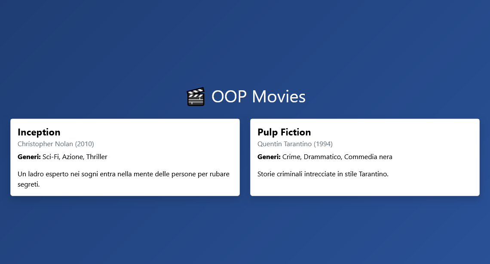

# 🎬 OOP Movies in PHP

Questo progetto è un'esercitazione di programmazione orientata agli oggetti (OOP) in PHP. L'obiettivo è creare un'applicazione che rappresenti un catalogo di film, ognuno associato a uno o più generi, e stampare a schermo una lista ben formattata con i dati dei film.

## 🧠 Obiettivi

- Creare una classe `Movie` con proprietà, costruttore e metodi.
- Creare una classe `Genre` per rappresentare i generi cinematografici.
- Associare uno o più generi a ciascun film.
- Organizzare il codice in maniera modulare usando più file.
- Stampare dinamicamente i film in una pagina web tramite Bootstrap.

## ✅ Funzionalità Implementate

- ✅ Classe `Movie` con proprietà come `title`, `director`, `releaseYear` e `genres`.
- ✅ Metodo per restituire una descrizione testuale del film.
- ✅ Metodo per mostrare i generi come stringa.
- ✅ Classe `Genre` per rappresentare ogni genere.
- ✅ Layout responsive con Bootstrap.
- ✅ Uso di un trait per aggiungere proprietà/metodi riutilizzabili (Bonus 2).
- ✅ Codice organizzato in:
  - Cartella `Models/` per le classi
  - File `db.php` per i dati (oggetti istanziati)
  - File `index.php` per la visualizzazione

## 🧩 Bonus Implementati

- ✅ **Bonus 1**: Supporto a più generi per film.
- ✅ **Bonus 2**: Trait PHP per aggiungere funzionalità comuni.
- ✅ **Bonus 3**: Layout responsive con Bootstrap e visualizzazione dinamica dei film.

## 🖼️ Screenshot

### 📄 Lista dei film

## 🗂️ Struttura del Progetto

/Models/ ├── Genre.php ├── Movie.php ├── Traits/ │ └── Description.php

db.php index.php Css/style.css screenshots README.md

## 🚀 Come Eseguire

1. Clona il progetto o scaricalo.
2. Avvia un server locale PHP (es. con XAMPP o MAMP).
3. Assicurati che i file siano accessibili tramite `localhost`.
4. Apri `index.php` nel browser.

## 📚 Tecnologie Utilizzate

- PHP 8+
- HTML5
- CSS3 (con Bootstrap 5)
- Paradigmi OOP: classi, oggetti, costruttori, metodi, traits

## 👨‍💻 Autore

- Giovanni Di Bello  
- [GitHub](https://github.com/giovannidibello)

